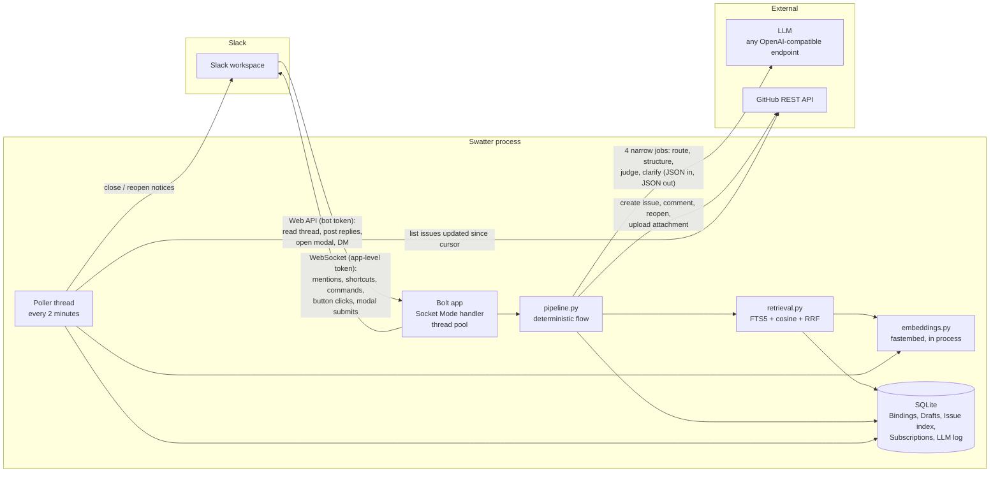
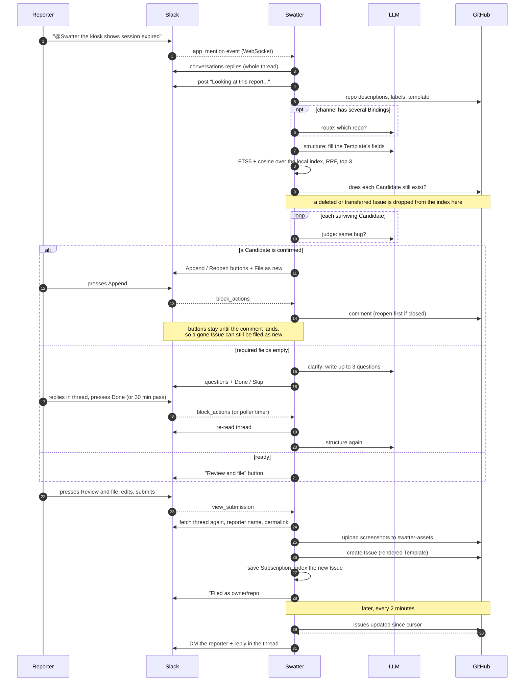

# How Swatter works

One Python process, no inbound network traffic, one SQLite file. Vocabulary is in
[CONTEXT.md](../CONTEXT.md); the reasoning behind each choice is in [adr/](adr/).

## Components

### The two Slack tokens

- The **app-level token** (`xapp-...`) opens one outbound WebSocket to Slack. Slack pushes every
  event the app subscribed to in its manifest down that socket: app mentions, the "File as bug"
  shortcut, the `/swatter` command, button clicks, and modal submissions. Nothing else arrives;
  Swatter does not see channel traffic beyond what the manifest asks for.
- The **bot token** (`xoxb-...`) is used the other way, for ordinary Web API calls: read a
  thread, post a reply, update a message, open a modal, send a DM.

Because the socket is outbound, the process can run behind NAT with no public URL. GitHub has no
equivalent of Socket Mode, so instead of webhooks the poller asks GitHub every two minutes for
Issues updated since a stored cursor (ADR 0001).

### Where the LLM is and is not used

The LLM never sees a raw Slack payload and never decides what happens next. Code fetches the
thread, strips the mention, decides which message is the Report, and then makes at most four
kinds of call, each returning JSON that is validated against a Pydantic schema and retried once
with the error fed back (ADR 0002, ADR 0004):

| Job | When | Input | Output |
|---|---|---|---|
| route | channel has more than one Binding | repo descriptions, Report | one repo from an enum |
| structure | every Report | Template fields, repo labels, Report, thread | field values, title, labels from an enum |
| judge | for each of up to three Candidates | Draft fields, one existing Issue | same bug yes/no, one-line reason |
| clarify | required fields empty and no Candidates | Report, missing field ids | up to N questions, screenshot flag |

Everything else is deterministic: which repos are searched, how Candidates are ranked, how many
questions are allowed, when the Clarification ends, how the Issue body is laid out, who gets
notified. Swapping the model changes the quality of the field values, never the layout or the flow.

### Where GitHub is used

Plain REST calls through PyGithub, not GitHub Actions:

- Read: repo description (routing hint), labels, issue template, Issues updated since the cursor,
  and whether one Issue still exists.
- Write: create an Issue, comment on one, reopen one, commit an image to the `swatter-assets`
  orphan branch so the Issue can embed it.

The existence check is there because deletion has no other signal. A deleted or transferred Issue
simply stops being listed, with no `updated_at` bump and no tombstone, so polling alone can never
notice it. Swatter therefore asks directly, in two places: before a Candidate is judged or shown,
and before an Append comments on one. A 404, or a redirect to another repo, drops the Issue from
the index; any other error keeps it, because a rate limit is not a deletion.

### Storage and search

One SQLite file holds everything. The Issue index is searched two ways without any external
service: an FTS5 table for keywords and an embedding vector per Issue for meaning, computed
in-process by fastembed. Results are merged with reciprocal rank fusion and the top three go to the
judge (ADR 0003). Rows leave the index only when GitHub says the Issue is gone — on sight during a
Report, or in bulk during `swatter sync`, which asks about every indexed Issue its full fetch did
not return. Every LLM prompt and response is logged, so `swatter eval` can measure a model
swap against the golden set.

## One Report, end to end

## Threads inside the process

- Bolt runs each incoming event on a worker thread and must acknowledge within three seconds.
  Handlers acknowledge first, then do the slow work (LLM and GitHub calls) on the same thread.
- The poller is one daemon thread. Besides syncing the index it ends Clarifications whose timer
  ran out, so no per-Draft timers are needed.
- Both share the SQLite connection through one lock (`db.py`). Draft state lives in the database,
  never in memory, so a button pressed hours later, or after a restart, still works.
